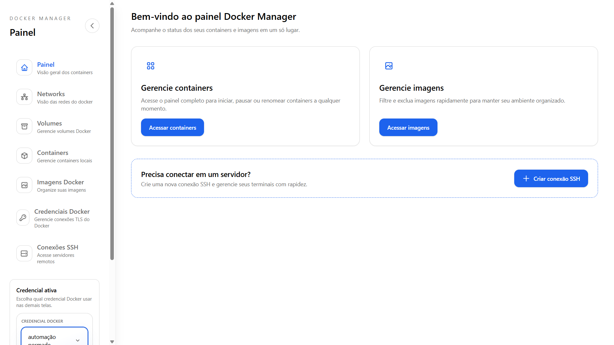
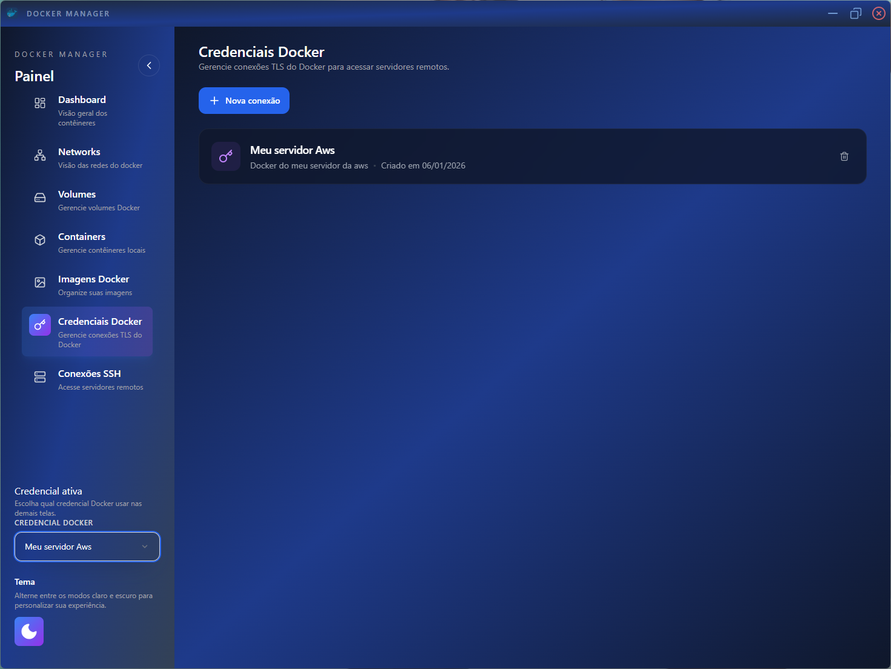
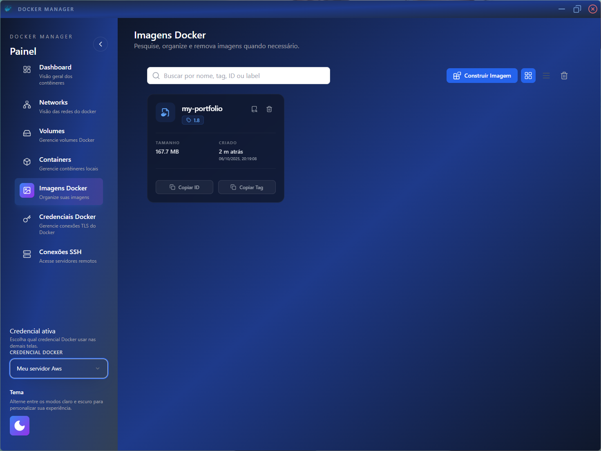
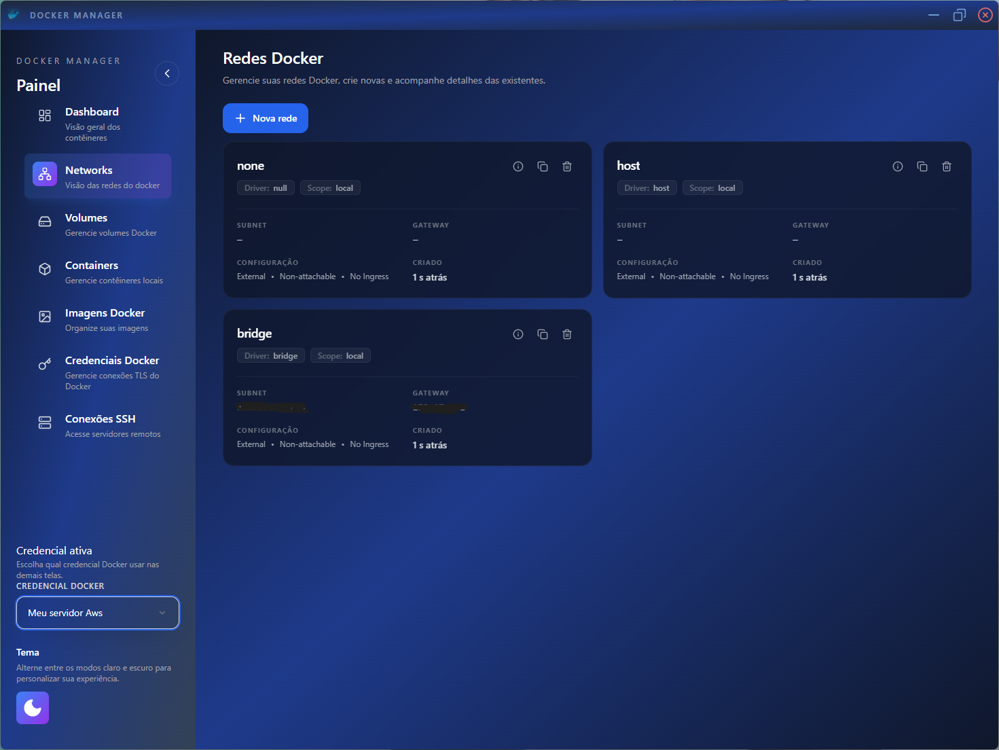
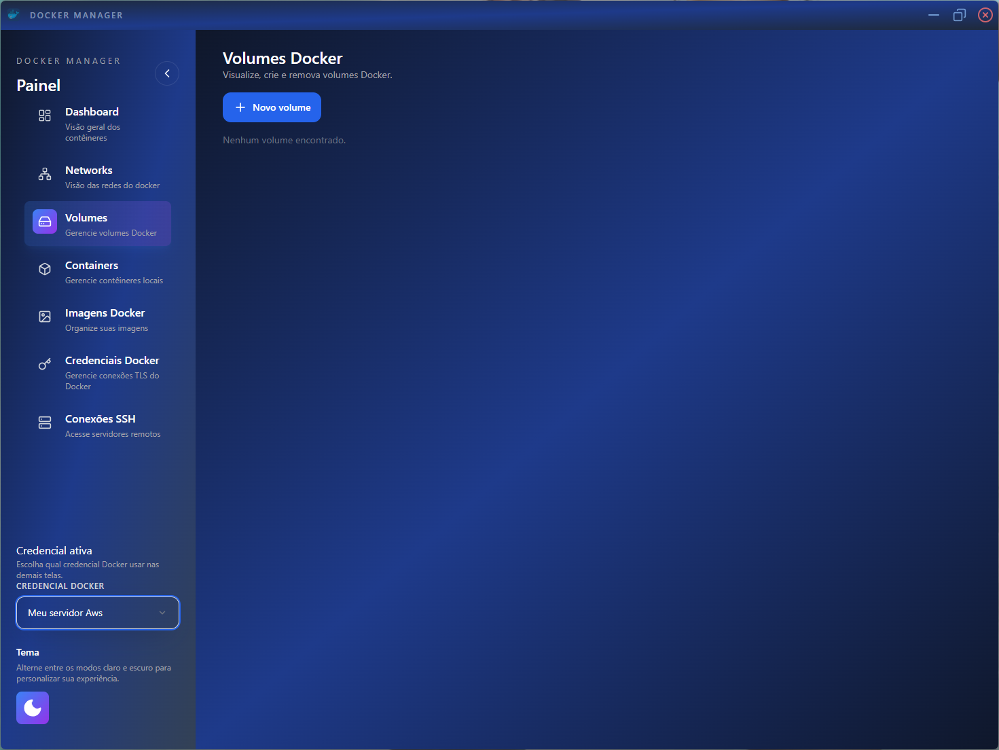
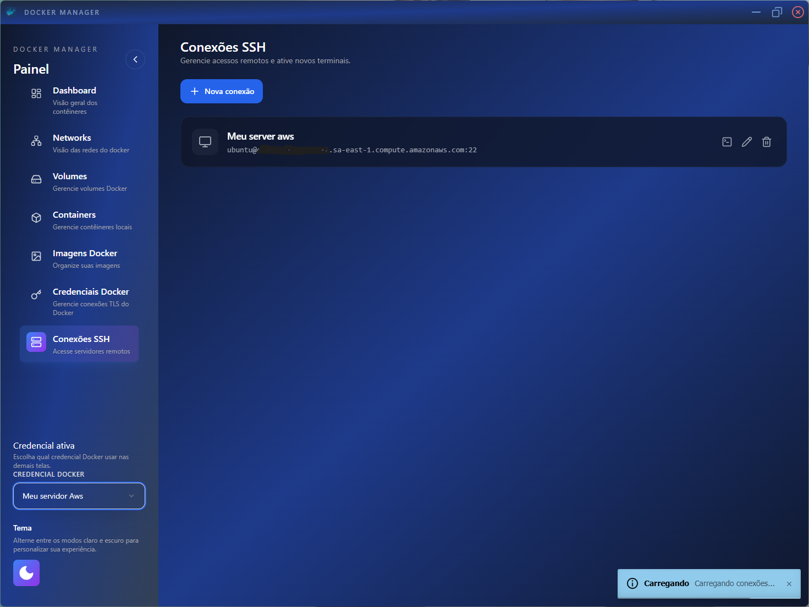
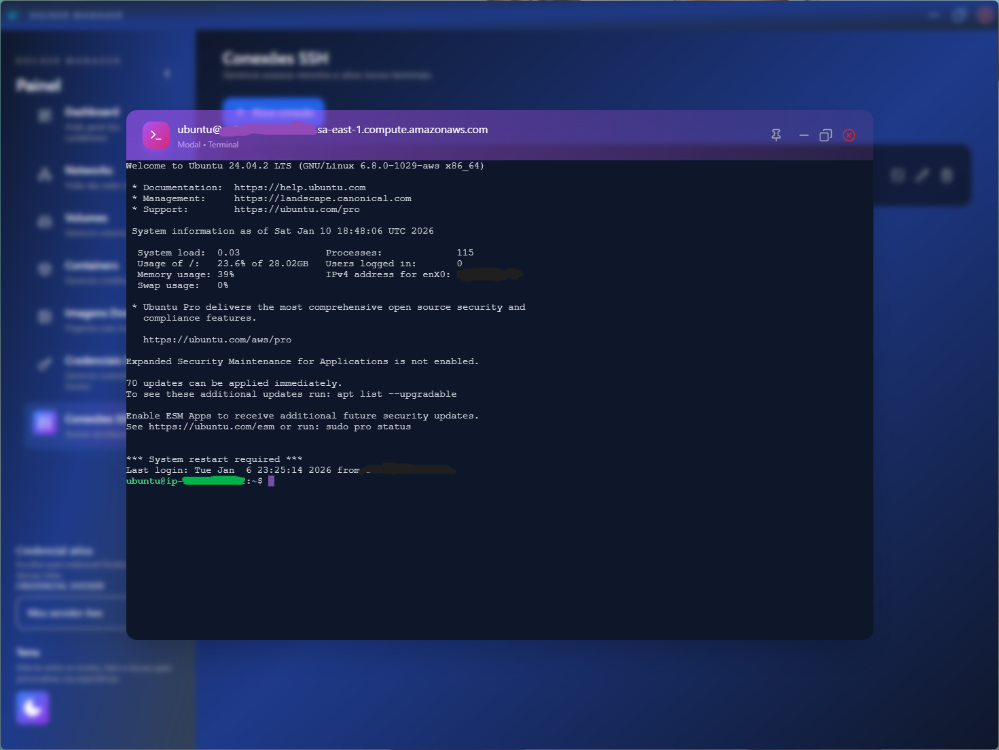
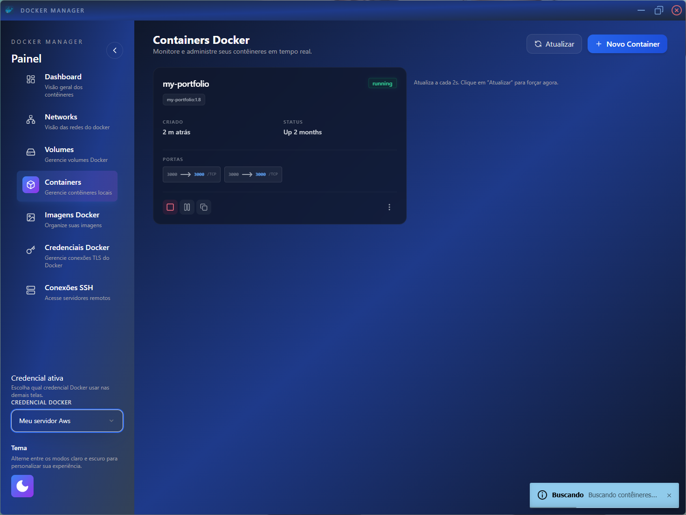

# Docker Manager (Wails)

Aplicação desktop construída com [Wails](https://wails.io/) que une backend em Go e frontend em React + Vite para gerenciar containers Docker e hosts remotos a partir de uma única interface.


## Visão geral

A ferramenta permite autenticação de usuários, conexão segura a daemons Docker expostos com TLS, criação de sessões SSH e controle de containers, imagens e redes. Tudo é orquestrado por um backend em Go que usa SQLite para persistência e a SDK oficial do Docker para executar comandos.

## Funcionalidades principais

- **Autenticação e sessões**: gerenciamento de login e persistência de sessão com o `auth.ManagerStruct`. 
- **Credenciais Docker TLS**: cadastro e conexão de endpoints Docker (CA/Cert/Key), com criptografia de campos sensíveis antes de salvar no banco. 
- **Painel de containers**: iniciar, parar, pausar, remover e visualizar estatísticas em tempo real (CPU, memória, rede) dos containers conectados. 
- **Imagens Docker**: listar,filtrar, remover imagens rapidamente e buildar imagens remotamente.
- **Redes Docker**: visualização e gerenciamento básico das redes disponíveis. 
- **Terminais SSH**: criação de conexões SSH para servidores remotos e abertura de terminais interativos pela interface.

## $\textcolor{green}{\textsf{Features Futuras}}$
-  **Docker Compose**: suporte para visualização, gerenciamento de arquivos compose e gereciamentos de contêineres usando compose.
- **Uploads e assets**: suporte para carregar e salvar imagens base64 (por exemplo, avatares) pelo backend.
- **Configuração de Docker registry**: suporte para configuração de Docker registry para push e pull de imagens(docker registry privado ou docker hub).

## Arquitetura

- **Backend (Go 1.24)**
  - `main.go` inicia o app Wails, configura o ciclo de vida e registra todos os handlers (Docker, SSH, terminal, autenticação e usuários). 
  - `app.go` mantém utilidades genéricas do app, como carregamento/gravação de imagens base64.
  - `src/handlers/` contém os controladores de domínio (Docker, Docker SDK, SSH, Terminal, Auth, User).
  - `src/models/` define os modelos persistidos em SQLite (por exemplo, `DockerCredentialsModel`).
  - `src/dtos/` agrupa DTOs usados pelo frontend, como `CreateDockerConnectionDto` e `StatsPayloadDto`.
  - `src/auth/` mantém a gestão de sessões e verificações de autorização.
  - `src/functions/` reúne helpers (validação de structs, tratamento de logs, cliente HTTP/TLS). 
  - `src/types/types.go` define tipos utilitários, como `EncryptedString` para armazenar dados sensíveis.

- **Frontend (React + Vite + Tailwind + Zustand)**
  - Estrutura em `frontend/src` com páginas de Containers, Imagens, Redes, Credenciais Docker, Login/Criação de conta e Terminal SSH.
  - Componentes protegidos por rota (`ProtectedRoute.tsx`) e estado global leve com Zustand.
  - Biblioteca Chart.js para gráficos e xterm.js para terminais interativos.

## $\textcolor{orange}{\textsf{Pré-requisitos}}$

- Go **1.24** ou superior (ver `go.mod`).
- Node.js **>= 18** e npm para o frontend (Vite).
- Docker instalado caso queira testar conexões locais.
- [Wails CLI](https://wails.io/docs/gettingstarted/installation) (`go install github.com/wailsapp/wails/v2/cmd/wails@latest`).

## Como rodar em modo desenvolvimento

1. **Instale dependências do frontend**
   ```bash
   cd frontend
   npm install
   ```
2. **Inicie o modo de desenvolvimento** (Wails recompila o backend e usa o dev server do Vite)
   ```bash
   wails dev
   ```
   A janela desktop será aberta com hot reload.

## Build de produção

1. Gere os assets do frontend:
   ```bash
   cd frontend
   npm run build
   ```
2. Volte para a raiz e faça o build do app desktop:
   ```bash
   cd ..
   wails build
   ```
   O binário será gerado conforme `outputfilename` em `wails.json`.

## Banco de dados

- Usa SQLite (via `github.com/glebarez/sqlite`).
- A inicialização é feita em `database.InitDb()` no startup do app.
- As credenciais Docker são armazenadas com campos criptografados (`EncryptedString`), reduzindo exposição de URLs e chaves privadas.

## Integração com Docker TLS

Para expor um daemon Docker em `tcp://<host>:2376` com certificados TLS válidos (CA/Cert/Key), siga o tutorial completo em [`Como criar credenciais para conexão com o daemon do docker`](mk/HowToGenerateDockerCredentials.md). Ele cobre geração de certificados, configuração do `daemon.json` e validação com `docker version`.

## Conexões SSH

O guia [`Como criar par de chaves para conexão ssh`](mk/HowtogenerateSshKeyToServer.md) mostra como gerar uma chave SSH segura para uso na tela de criação de conexão e no terminal embutido.

## Estrutura de comandos úteis

- Formatação do frontend: `npm run format`
- Preview dos assets gerados: `npm run preview`
- Dev server isolado do frontend: `npm run dev` (apenas interface, útil para ajustes de UI)

## Downloads
- [Windows](https://github.com/viniggj2005/docker-manager/releases/latest/download/Docker.Manager.exe)
- [linux](https://github.com/viniggj2005/docker-manager/releases/latest/download/Docker.Manager)

## Screenshots
## Screenshots










## Licença

Distribuído sob a licença MIT. Consulte o arquivo [`LICENSE`](LICENSE) para mais detalhes.
